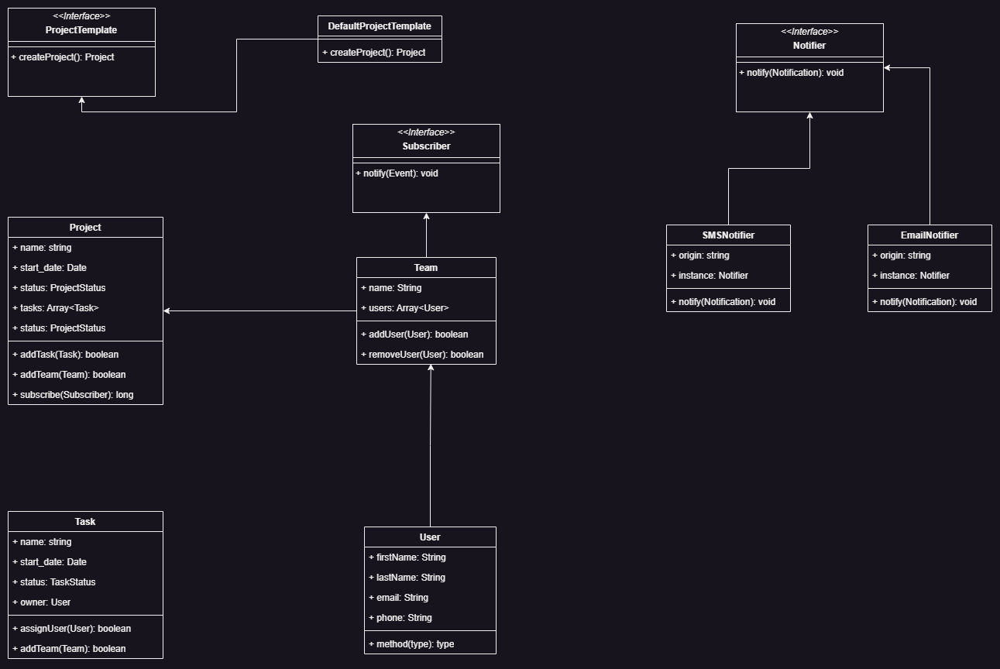

# LLD

***

<figure>
    
    <figcaption>Project management tool</figcaption>
</figure>

>### Template
> 
> 

>### Project
> 
> `name`, `start_date`, `end_date`, `tasks` , `status`, `teams`
> 
> `updateProject(ProjectUpdate request)` - updates a project
> 
> `addTask(Task)` - Adds a new task
> 
> `addTeam(Team)` - Adds a new team
> 
> `subscribe(EventType, Subscriber)` - subscribes for any event

>### Task
>
> `name`, `start_date`, `end_date`, `user`, `status`, `dependencies`
>
> `updateTask(TaskUpdate request)` - updates a task
> 
> `transferOwnership(User)` - updates the owner of the task
> 
> `addDependency(Task dependency)` - Adds another task as a dependency
>
> `subscribe(EventType, Subscriber)` - Allow clients to subscribe for events

>### Team
> 
> `team_name`, `users`, `projects`
> 
> `updateTeam(TeamUpdate request)` - update the team info
> 
> `addUser(User)` - adds a user to the team
> 
> `getUsers()` - get all the users
> 
> `getProjects()` - get all the projects

>### User
> `first_name`, `second_name`, `teams`, `location`
> 
> `updateUser(UserUpdate request)` - updates the user

